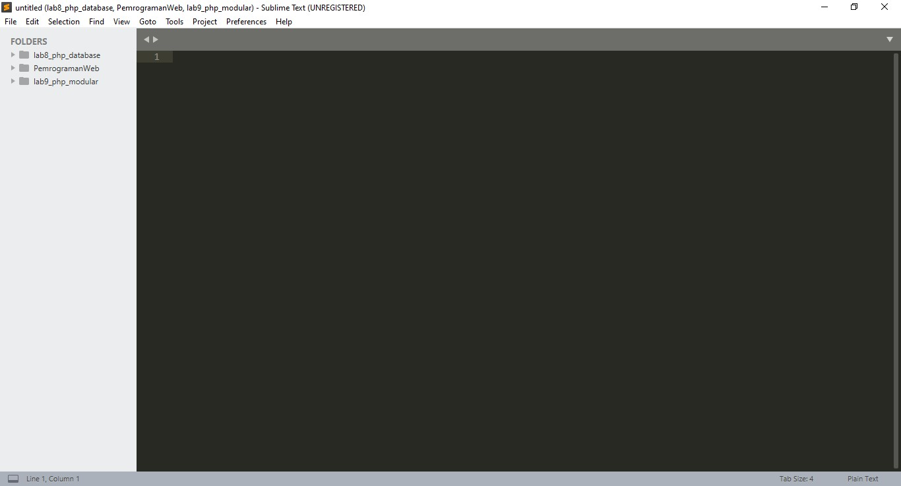
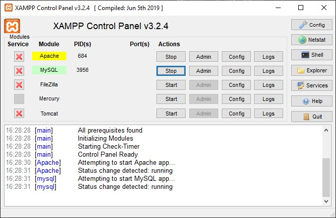
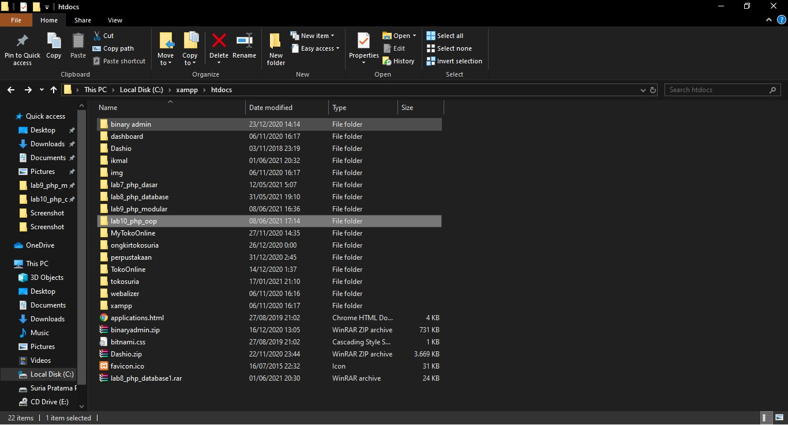
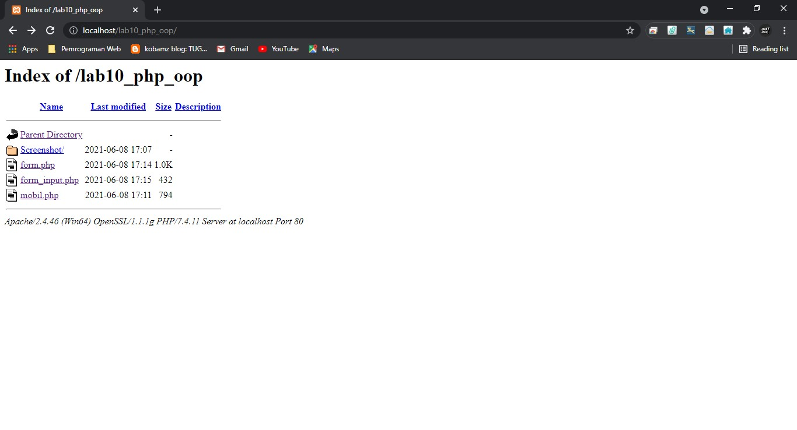
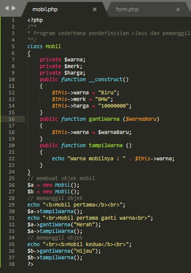
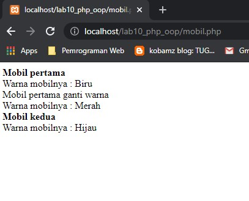
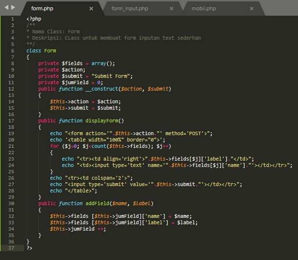
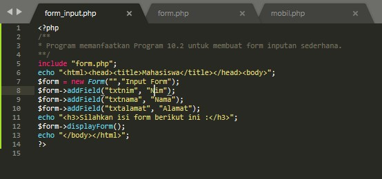
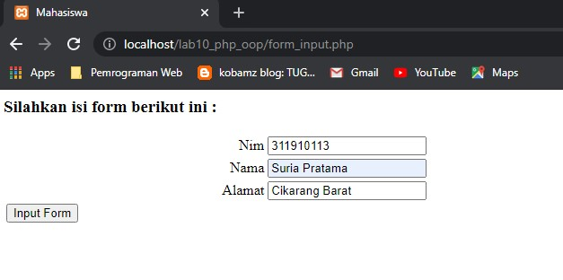

# Persiapan dan Langkah - langkah

 Membuka Sublime Text 

 Membuka Xampp 

 Membuat foldernya 

 Buka Google Chrome dan akses link localhost 

 Input file dari (mobil.php) 

 Hasil output dari (mobil.php) 

 Input file dari (form.php) 

 Input file dari (form_input.php) 

 Hasil output dari (form_input.php) 

# Penjelasan

 form_input.php akan otomatis tersinkron denga form.php sehingga saat form_input.php dipanggil, form.php juga akan terpanggil, oleh karena itu saat memanggil tidak terjadi apa apa. 

